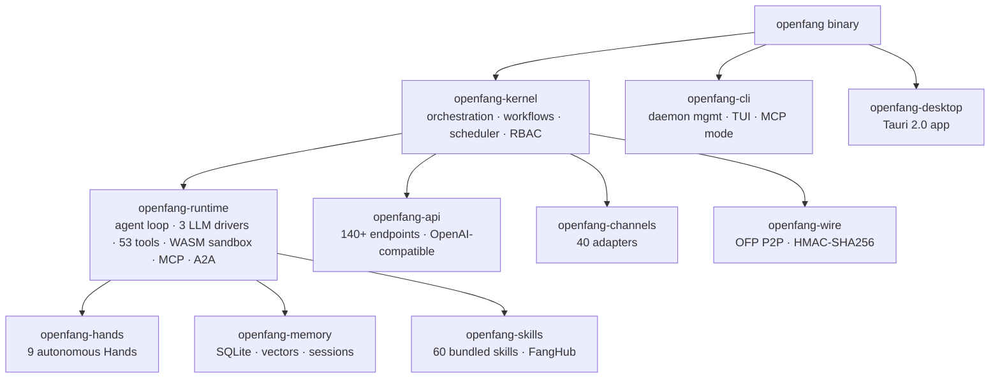

<p align="center">
  
</p>

<h1 align="center">OpenFang</h1>
<h3 align="center">The Agent Operating System</h3>

<div align="right">


</div>

> **Rig** — this is Chris's fork of OpenFang ([upstream](https://github.com/RightNow-AI/openfang)). Fork home: [toxicwind/rig](https://github.com/toxicwind/rig).
>
> Binary, crate, config-path and env-var names still say `openfang` for ecosystem compatibility; the full product rename is tracked separately.

> **Pre-1.0 notice**
>
> OpenFang is feature complete but still pre-1.0. Expect rough edges and breaking changes between minor versions. We ship fast and fix fast. Pin to a specific commit for production use until v1.0. [Report issues here.](https://github.com/toxicwind/rig/issues)

## Why should you care?

OpenFang is an **open-source Agent Operating System** — not a chatbot framework, not a Python wrapper around an LLM, not a "multi-agent orchestrator." A full OS for autonomous agents, built from scratch in Rust: **160K+ lines, 14 workspace crates, 2,696+ tests, zero clippy warnings (CI-enforced)**.

Traditional agent frameworks wait for you to type something. OpenFang runs **autonomous agents that work for you**: on schedules, 24/7 — building knowledge graphs, monitoring targets, generating leads, managing social media, reporting to your dashboard. The entire system compiles to a **single binary**. One install, one command, your agents are live.

**License:** [Apache-2.0 OR MIT](LICENSE-APACHE) · **Security:** [16 security systems](#16-security-systems-defense-in-depth), [SECURITY.md](SECURITY.md)

<p align="center">
  <a href="https://openfang.sh/docs">Documentation</a> &bull;
  <a href="https://openfang.sh/docs/getting-started">Quick Start</a> &bull;
  <a href="https://x.com/openfangg">Twitter / X</a>
</p>

## Features

- **Hands** — pre-built autonomous capability packages (9 bundled) that run on schedules without prompting: researcher, coder, and more, each with a 500+ word operational playbook, `HAND.toml` manifest, `SKILL.md` reference, and approval guardrails
- **Single binary** — everything compiled in: no pip install, no Docker pull, no downloads at runtime
- **40 channel adapters** — messaging adapters with rate limiting and DM/group policies, including a WhatsApp Web gateway (QR code)
- **38 LLM providers, 200+ models** — 3 LLM drivers in the runtime, OpenAI-compatible API
- **16 security systems** — WASM dual-metered sandbox, Merkle audit trail, taint tracking, Ed25519 manifests, SSRF protection, prompt-injection scanner, and more
- **Memory that persists** — SQLite persistence, vector embeddings, canonical sessions, compaction
- **P2P wire protocol** — OFP with HMAC-SHA256 mutual authentication
- **Desktop + CLI + API** — Tauri 2.0 native app, CLI with TUI dashboard and MCP server mode, 140+ REST/WS/SSE endpoints
- **Migration engine** — from OpenClaw, LangChain, AutoGPT

## Architecture



14 Rust crates. 160K+ lines of Rust. Modular kernel design.

```
openfang-kernel      Orchestration, workflows, metering, RBAC, scheduler, budget tracking
openfang-runtime     Agent loop, 3 LLM drivers, 53 tools, WASM sandbox, MCP, A2A
openfang-api         140+ REST/WS/SSE endpoints, OpenAI-compatible API, dashboard
openfang-channels    40 messaging adapters with rate limiting, DM/group policies
openfang-memory      SQLite persistence, vector embeddings, canonical sessions, compaction
openfang-types       Core types, taint tracking, Ed25519 manifest signing, model catalog
openfang-skills      60 bundled skills, SKILL.md parser, FangHub marketplace
openfang-hands       9 autonomous Hands, HAND.toml parser, lifecycle management
openfang-extensions  25 MCP templates, AES-256-GCM credential vault, OAuth2 PKCE
openfang-wire        OFP P2P protocol with HMAC-SHA256 mutual authentication
openfang-cli         CLI with daemon management, TUI dashboard, MCP server mode
openfang-desktop     Tauri 2.0 native app (system tray, notifications, global shortcuts)
openfang-migrate     OpenClaw, LangChain, AutoGPT migration engine
xtask                Build automation
```

## Quick start

```bash
curl -fsSL https://openfang.sh/install | sh
openfang init     # walks you through provider setup
openfang start    # dashboard live at http://localhost:4200
```

Then: `openfang hand activate researcher` — it starts working for you.
`openfang chat researcher` to talk to an agent. `openfang agent spawn coder`
for a pre-built agent.

<details>
<summary><strong>Windows (PowerShell)</strong></summary>

```powershell
irm https://openfang.sh/install.ps1 | iex
openfang init
openfang start
```

</details>

## Hands: agents that actually do things

<p align="center"><em>"Traditional agents wait for you to type. Hands work <strong>for</strong> you."</em></p>

**Hands** are OpenFang's core innovation. Pre-built autonomous capability packages that run independently, on schedules, without you having to prompt them. A Hand wakes up at 6 AM, researches your competitors, builds a knowledge graph, scores the findings, and delivers a report to your Telegram before you've had coffee.

Each Hand bundles:

- **HAND.toml**: manifest declaring tools, settings, requirements, and dashboard metrics
- **System Prompt**: multi-phase operational playbook — 500+ word expert procedures, not one-liners
- **SKILL.md**: domain expertise reference injected into context at runtime
- **Guardrails**: approval gates for sensitive actions (e.g. Browser Hand requires approval before any purchase)

All compiled into the binary. No downloading, no pip install, no Docker pull.

## OpenFang vs the landscape

<p align="center">
  
</p>

Benchmarks: measured, not marketed (official docs and public repos, February 2026):

| Metric (lower is better) | OpenFang | OpenClaw | LangGraph | CrewAI |
|---|---|---|---|---|
| Cold start | **180 ms** ★ | 5.98 sec | 2.5 sec | 3.0 sec |
| Idle memory | **40 MB** ★ | 394 MB | 180 MB | 200 MB |
| Install size | **32 MB** ★ | — | 150 MB | 100 MB |

## 16 security systems: defense in depth

| # | System | What it does |
|---|---|---|
| 1 | **WASM Dual-Metered Sandbox** | Tool code runs in WebAssembly with fuel metering + epoch interruption; a watchdog thread kills runaway code |
| 2 | **Merkle Hash-Chain Audit Trail** | Every action cryptographically linked to the previous one — tamper with one entry and the chain breaks |
| 3 | **Information Flow Taint Tracking** | Labels propagate through execution; secrets tracked from source to sink |
| 4 | **Ed25519 Signed Agent Manifests** | Every agent identity and capability set cryptographically signed |
| 5 | **SSRF Protection** | Blocks private IPs, cloud metadata endpoints, DNS rebinding attacks |
| 6 | **Secret Zeroization** | `Zeroizing<String>` auto-wipes API keys from memory the instant they're no longer needed |
| 7 | **OFP Mutual Authentication** | HMAC-SHA256 nonce-based, constant-time verification for P2P |
| 8 | **Capability Gates** | Role-based access control; agents declare required tools, the kernel enforces it |
| 9 | **Security Headers** | CSP, X-Frame-Options, HSTS, X-Content-Type-Options on every response |
| 10 | **Health Endpoint Redaction** | Public health check returns minimal info; full diagnostics require auth |
| 11 | **Subprocess Sandbox** | `env_clear()` + selective passthrough; process-tree isolation with cross-platform kill |
| 12 | **Prompt Injection Scanner** | Detects override attempts, data exfiltration patterns, shell reference injection in skills |
| 13 | **Loop Guard** | SHA256-based tool-call loop detection with circuit breaker |
| 14 | **Session Repair** | 7-phase message history validation and automatic recovery from corruption |
| 15 | **Path Traversal Prevention** | Canonicalization with symlink escape prevention — `../` doesn't work here |
| 16 | **GCRA Rate Limiter** | Cost-aware token bucket rate limiting with per-IP tracking and stale cleanup |

## Configuration

`openfang.toml.example` at the repo root documents the config surface. Binary,
crate, config-path and env-var names still say `openfang` for ecosystem
compatibility. The WhatsApp Web gateway pairs via QR code.

## Dev & contributing

```bash
cargo build --workspace --lib                    # build the workspace
cargo test --workspace                           # run all tests (2,696+)
cargo clippy --workspace --all-targets -- -D warnings   # lint (must be 0 warnings)
cargo fmt --all -- --check                       # format
```

See [CONTRIBUTING.md](CONTRIBUTING.md), [MIGRATION.md](MIGRATION.md), and
[docs/](docs/) for more. Rust 1.75+, edition 2021. `test_vertex_e2e.py` covers
end-to-end vertex flows.

## License & security

Dual-licensed [Apache-2.0](LICENSE-APACHE) OR [MIT](LICENSE-MIT). Security
policy: [SECURITY.md](SECURITY.md). Pre-1.0: pin to a specific commit for
production use.

Built by [RightNow](https://github.com/RightNow-AI/openfang) upstream; this
fork lives at [toxicwind/rig](https://github.com/toxicwind/rig).
