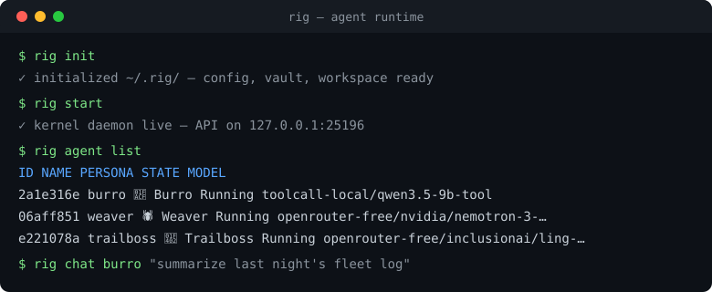
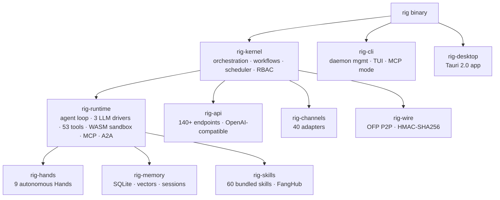

[](https://github.com/toxicwind/rig/actions/workflows/ci.yml)
[](https://www.rust-lang.org)
[](LICENSE-APACHE)
[](CHANGELOG.md)
[](#dev--contributing)

<p align="center">
  
</p>

<h1 align="center">Rig</h1>
<p align="center"><strong>A self-hosted runtime that runs autonomous AI agents for you, 24/7 — from a single binary.</strong></p>

<p align="center">
  <a href="docs/">Explore the docs »</a> ·
  <a href="#quickstart">Quickstart »</a> ·
  <a href="https://github.com/toxicwind/rig/issues/new?labels=bug&template=bug-report.md">Report Bug</a> ·
  <a href="https://github.com/toxicwind/rig/issues/new?labels=enhancement&template=feature-request.md">Request Feature</a>
</p>



> **Rig** is Chris's fork of OpenFang ([upstream](https://github.com/RightNow-AI/rig)). Fork home: [toxicwind/rig](https://github.com/toxicwind/rig).
>
> Binary, crate, config-path and env-var names still say `rig` for ecosystem compatibility; the full product rename is tracked separately.
>
> **Pre-1.0 notice:** Rig is feature-complete but pre-1.0. Expect rough edges and breaking changes between minor versions. We ship fast and fix fast. Pin to a specific commit for production use until v1.0.

<details>
<summary><strong>Table of Contents</strong></summary>
<ol>
  <li><a href="#why-rig">Why Rig?</a></li>
  <li><a href="#built-with">Built With</a></li>
  <li><a href="#quickstart">Quickstart</a></li>
  <li><a href="#usage">Usage</a></li>
  <li><a href="#features">Features</a></li>
  <li><a href="#architecture">Architecture</a></li>
  <li><a href="#hands-agents-that-actually-do-things">Hands</a></li>
  <li><a href="#rig-vs-the-landscape">Rig vs the landscape</a></li>
  <li><a href="#security">Security</a></li>
  <li><a href="#roadmap">Roadmap</a></li>
  <li><a href="#configuration">Configuration</a></li>
  <li><a href="#dev--contributing">Dev &amp; Contributing</a></li>
  <li><a href="#license">License</a></li>
  <li><a href="#contact">Contact</a></li>
</ol>
</details>

## Why Rig?

Traditional agent frameworks wait for you to type something. Rig runs **autonomous agents that work for you**: on schedules, 24/7 — building knowledge graphs, monitoring targets, generating leads, managing social media, reporting to your dashboard. Not a chatbot framework, not a Python wrapper around an LLM. A full runtime for autonomous agents, built from scratch in Rust: **160K+ lines, 14 workspace crates, 2,696+ tests, zero clippy warnings (CI-enforced)**. The entire system compiles to a **single binary**. One install, one command, your agents are live.

## Built With

- [Rust](https://www.rust-lang.org) — the whole runtime, 14 workspace crates
- [Tokio](https://tokio.rs) — async kernel, scheduler, 140+ REST/WS/SSE endpoints
- [SQLite](https://www.sqlite.org) (+ vectors) — persistent agent memory
- [Tauri 2.0](https://tauri.app) — native desktop app
- [WebAssembly](https://webassembly.org) — dual-metered tool sandbox

## Quickstart

Copy-paste to your first running agent in under 30 seconds:

```bash
curl -fsSL https://rig.sh/install | sh
rig init     # walks you through provider setup
rig start    # kernel daemon live — API on 127.0.0.1:25196
rig agent list   # see your agents
```

Then talk to one:

```bash
rig chat assistant        # quick chat with the default agent
rig agent new coder       # spawn a pre-built coder agent
rig hand activate researcher  # it starts working for you on a schedule
```

<details>
<summary><strong>Windows (PowerShell)</strong></summary>

```powershell
irm https://rig.sh/install.ps1 | iex
rig init
rig start
```

</details>

## Usage

The three things you'll do most, with real output:

**1. List agents**
```bash
$ rig agent list
ID        NAME       PERSONA      STATE     MODEL
2a1e316e  burro      🫏 Burro     Running   toolcall-local/qwen3.5-9b-tool
06aff851  weaver     🕷 Weaver    Running   openrouter-free/nvidia/nemotron-3-…
```

**2. Chat with an agent**
```bash
$ rig chat burro "summarize last night's fleet log"
```

**3. Run a workflow**
```bash
$ rig workflow run nightly-research
```

More: [CLI reference](docs/cli-reference.md) · [API reference](docs/api-reference.md) · [examples/](examples/)

## Features

- **Hands** — pre-built autonomous capability packages (9 bundled) that run on schedules without prompting: researcher, coder, and more, each with a 500+ word operational playbook, `HAND.toml` manifest, `SKILL.md` reference, and approval guardrails
- **Single binary** — everything compiled in: no pip install, no Docker pull, no downloads at runtime
- **40 channel adapters** — messaging adapters with rate limiting and DM/group policies, including a WhatsApp Web gateway (QR code)
- **38 LLM providers, 200+ models** — 3 LLM drivers in the runtime, OpenAI-compatible API
- **16 security systems** — WASM dual-metered sandbox, Merkle audit trail, taint tracking, Ed25519 manifests, SSRF protection, prompt-injection scanner, and more
- **Memory that persists** — SQLite persistence, vector embeddings, canonical sessions, compaction
- **P2P wire protocol** — OFP with HMAC-SHA256 mutual authentication
- **Desktop + CLI + API** — Tauri 2.0 native app, CLI with TUI dashboard and MCP server mode, 140+ REST/WS/SSE endpoints
- **Migration engine** — from OpenClaw, LangChain, AutoGPT

## Architecture



14 Rust crates. 160K+ lines of Rust. Modular kernel design.

```
rig-kernel      Orchestration, workflows, metering, RBAC, scheduler, budget tracking
rig-runtime     Agent loop, 3 LLM drivers, 53 tools, WASM sandbox, MCP, A2A
rig-api         140+ REST/WS/SSE endpoints, OpenAI-compatible API, dashboard
rig-channels    40 messaging adapters with rate limiting, DM/group policies
rig-memory      SQLite persistence, vector embeddings, canonical sessions, compaction
rig-types       Core types, taint tracking, Ed25519 manifest signing, model catalog
rig-skills      60 bundled skills, SKILL.md parser, FangHub marketplace
rig-hands       9 autonomous Hands, HAND.toml parser, lifecycle management
rig-extensions  25 MCP templates, AES-256-GCM credential vault, OAuth2 PKCE
rig-wire        OFP P2P protocol with HMAC-SHA256 mutual authentication
rig-cli         CLI with daemon management, TUI dashboard, MCP server mode
rig-desktop     Tauri 2.0 native app (system tray, notifications, global shortcuts)
rig-migrate     OpenClaw, LangChain, AutoGPT migration engine
xtask                Build automation
```

## Hands: agents that actually do things

<p align="center"><em>"Traditional agents wait for you to type. Hands work <strong>for</strong> you."</em></p>

**Hands** are Rig's core innovation. Pre-built autonomous capability packages that run independently, on schedules, without you having to prompt them. A Hand wakes up at 6 AM, researches your competitors, builds a knowledge graph, scores the findings, and delivers a report to your Telegram before you've had coffee.

Each Hand bundles:

- **HAND.toml**: manifest declaring tools, settings, requirements, and dashboard metrics
- **System Prompt**: multi-phase operational playbook — 500+ word expert procedures, not one-liners
- **SKILL.md**: domain expertise reference injected into context at runtime
- **Guardrails**: approval gates for sensitive actions (e.g. Browser Hand requires approval before any purchase)

All compiled into the binary. No downloading, no pip install, no Docker pull.

## Rig vs the landscape

Benchmarks: measured, not marketed (official docs and public repos, February 2026):

| Metric (lower is better) | Rig | OpenClaw | LangGraph | CrewAI |
|---|---|---|---|---|
| Cold start | **180 ms** ★ | 5.98 sec | 2.5 sec | 3.0 sec |
| Idle memory | **40 MB** ★ | 394 MB | 180 MB | 200 MB |
| Install size | **32 MB** ★ | — | 150 MB | 100 MB |

## Security

16 systems, defense in depth. Highlights:

| # | System | What it does |
|---|---|---|
| 1 | **WASM Dual-Metered Sandbox** | Tool code runs in WebAssembly with fuel metering + epoch interruption |
| 2 | **Merkle Hash-Chain Audit Trail** | Every action cryptographically linked — tamper-evident |
| 3 | **Taint Tracking** | Secrets tracked from source to sink through execution |
| 4 | **Ed25519 Signed Manifests** | Every agent identity and capability set cryptographically signed |
| 5 | **SSRF Protection** | Blocks private IPs, cloud metadata endpoints, DNS rebinding |
| 12 | **Prompt Injection Scanner** | Detects override attempts and exfiltration patterns in skills |

Full list: [SECURITY.md](SECURITY.md).

## Roadmap

- [x] Single-binary agent runtime (14 Rust crates, 2,696+ tests)
- [x] 40 channel adapters + 60 bundled skills + 9 autonomous Hands
- [x] 140+ REST/WS/SSE endpoints, OpenAI-compatible API
- [x] 16 security systems (WASM sandbox, Merkle audit trail, taint tracking)
- [x] Desktop app (Tauri 2.0), TUI dashboard, MCP server mode
- [ ] v1.0 API stability commitment
- [ ] Full product rename (`rig` binary/crate names; tracked separately)
- [ ] Hosted FangHub skill marketplace
- [ ] Multi-node P2P mesh (OFP) beyond single-host

Have a feature in mind? [Request it here.](https://github.com/toxicwind/rig/issues/new?labels=enhancement&template=feature-request.md)

## Configuration

`rig.toml.example` at the repo root documents the config surface. Binary,
crate, config-path and env-var names still say `rig` for ecosystem
compatibility. The WhatsApp Web gateway pairs via QR code.

## Dev & Contributing

```bash
cargo build --workspace --lib                    # build the workspace
cargo test --workspace                           # run all tests (2,696+)
cargo clippy --workspace --all-targets -- -D warnings   # lint (must be 0 warnings)
cargo fmt --all -- --check                       # format
```

See [CONTRIBUTING.md](CONTRIBUTING.md) and [docs/](docs/) for more. Rust 1.75+, edition 2021.

## License

Dual-licensed [Apache-2.0](LICENSE-APACHE) OR [MIT](LICENSE-MIT). Security
policy: [SECURITY.md](SECURITY.md). Pre-1.0: pin to a specific commit for
production use.

## Contact

Maintainer: [toxicwind](https://github.com/toxicwind) — issues and discussions
live at [toxicwind/rig](https://github.com/toxicwind/rig). Upstream OpenFang:
[RightNow-AI/rig](https://github.com/RightNow-AI/rig).

## Acknowledgments

Built on the shoulders of [OpenFang](https://github.com/RightNow-AI/rig)
by RightNow — this fork carries its architecture forward. Thanks to every
contributor upstream and here.

---

⭐ Don't forget to give the project a star! Thanks again!
